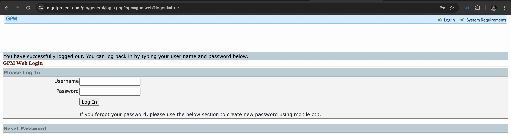
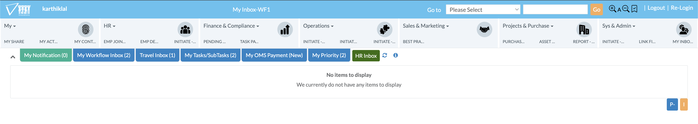
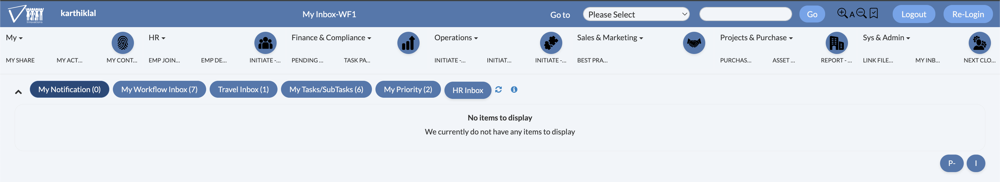
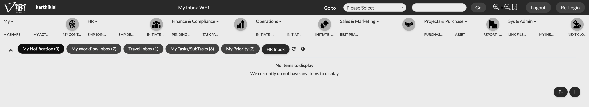
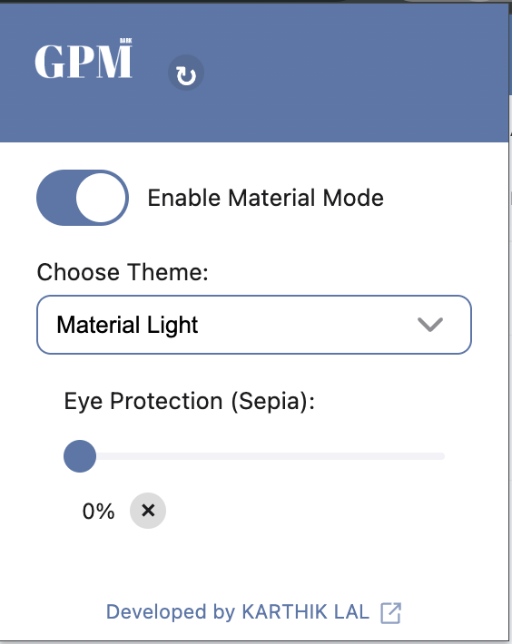
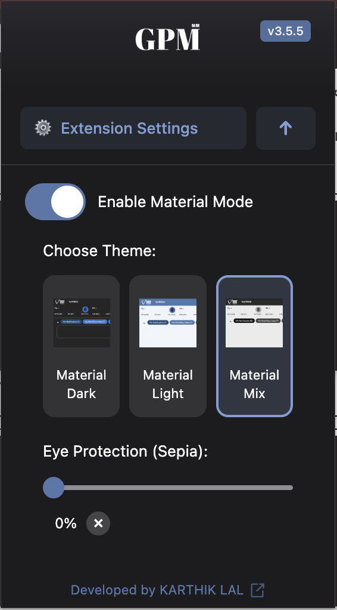

<div align="center">


[](LICENSE)

</div>

## 📖 Table of Contents

- [Preview](#-preview)
- [Features](#-features)
- [Installation](#-installation)
- [Usage](#️️-usage)
- [Contributing](#-contributing)
- [License](#-license)

## 🖼️ Preview

- <b> Extension Preview </b>

- <b> Theme Preview Light Mode (Official one)</b>

- <b> Theme Preview Material Dark Mode</b>

- <b> Theme Preview Material Light Mode</b>


- <b> Theme Preview Light Dark Mode</b>

- <div style="display: flex; gap: 10px;">
  <div style="flex: 1;">
    <b>Extension Preview (Light)</b><br>
    
  </div>
  <div style="flex: 1;">
    <b>Extension Preview (Dark)</b><br>
    
  </div>
</div>

## 🌟 Features

- **Browser Compatibility**
  - Works on Chrome, Edge, and other Chromium-based browsers
  - Firefox
  - Safari support (Upcoming)

- **Multiple Theme Support**
  - Theme 1 (Material Dark Mode)
  - Theme 2 (Material Light Mode) - Default
  - Theme 3 (Solarized Dark Mode) - (Upcoming)
  - Theme 4 (Solarized Light Mode) - (Upcoming)

- **Smart Color Management**
  - Preserves important UI elements
  - Dynamic content adaptation
  - Customizable color palette (Implemented in code)
  - Sepia Filter for better readability

- **User-Friendly Interface**
  - One-click material theme switching
  - Easy-to-use toggle switch
  - iOS-like design for toggle box

## 📥 Installation (Chrome)

1. Clone the repository: <b> (Optional) </b>

```bash
git clone https://github.com/karthik558/GPM-DarkMode.git
```

2. Download the ZIP from the [latest release](https://github.com/karthik558/GPM-DarkMode/releases) <b> (Recommended) </b>

3. Extract the ZIP to a directory of your choice

4. Open Chrome and navigate to:

```
chrome://extensions/
```

5. Enable "Developer mode" in the top right corner

6. Click "Load unpacked" and select the extension directory

7. Pin the extension to your browser toolbar for easy access

## 📥 Installation (Firefox
1. Clone the repository: <b> (Optional) </b>

```bash
git clone https://github.com/karthik558/GPM-DarkMode.git
```
2. Download the xpi file from this link: [GPM-DarkMode.xpi](https://addons.mozilla.org/firefox/downloads/file/4459342/97e73e7413e743b68deb-3.2.1.xpi) <b> (Recommended) </b>
3. Open Firefox and navigate to:

```
about:debugging#/runtime/this-firefox
```
4. Click on "Load Temporary Add-on" and select the xpi file
5. Pin the extension to your browser toolbar for easy access

<b>(Note: Soon to be available on Firefox Add-ons store</b>

## 🛠️ Usage

1. Click the extension icon in your browser toolbar
2. Toggle dark mode on/off using the switch
3. Settings are automatically saved and persist between sessions
4. To switch themes, click the extension icon and select your desired theme from the dropdown menu
5. To reset to default settings, toggle the switch off and on again
6. To uninstall the extension, right-click the extension icon and select "Remove from Chrome" or "Remove from Firefox"

## 🧱 Built With

- [HTML5](https://www.w3.org/TR/html52/) - The markup language for the web
- [CSS3](https://www.w3.org/Style/CSS/) - The style sheet language for the web
- [JavaScript](https://www.javascript.com/) - The programming language for the web
- [WebExtensions API](https://developer.mozilla.org/en-US/docs/Mozilla/Add-ons/WebExtensions) - The standard for browser extensions
- [Material Design](https://material.io/) - The design system for the web

## 🤝 Contributing

1. Fork the repository
2. Create your feature branch:

```bash
git checkout -b feature/YourFeature
```

3. Commit your changes:

```bash
git commit -m 'Add some feature'
```

4. Push to the branch:

```bash
git push origin feature/YourFeature
```

5. Open a Pull Request

## 📝 License

This project is licensed under the MIT License - see the [LICENSE](LICENSE) file for details.

## ⛔️ DMCA

This project is not affiliated with GPM team. This project is open-source and free to use. If you have any concerns, please contact me directly.

---

<div align="center">

Made with ❤️ by [KARTHIK LAL](https://karthiklal.in)

</div>
